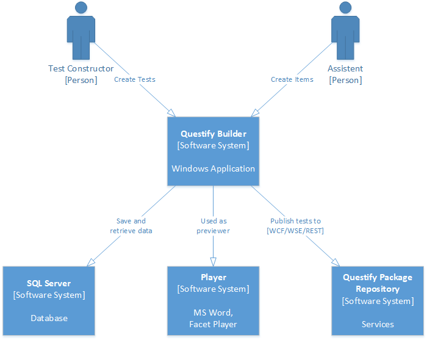
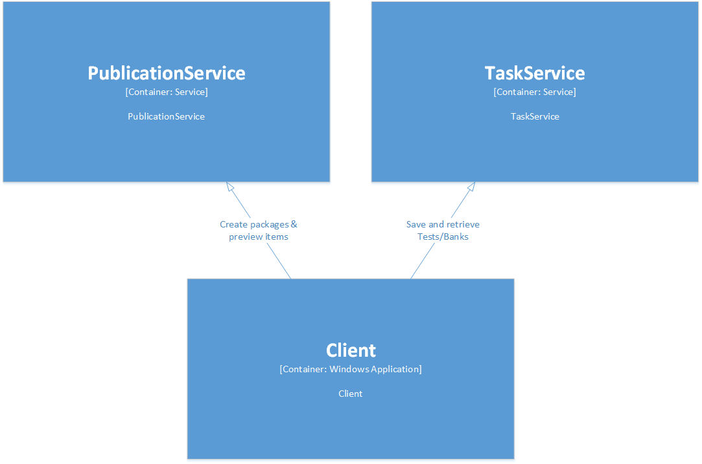
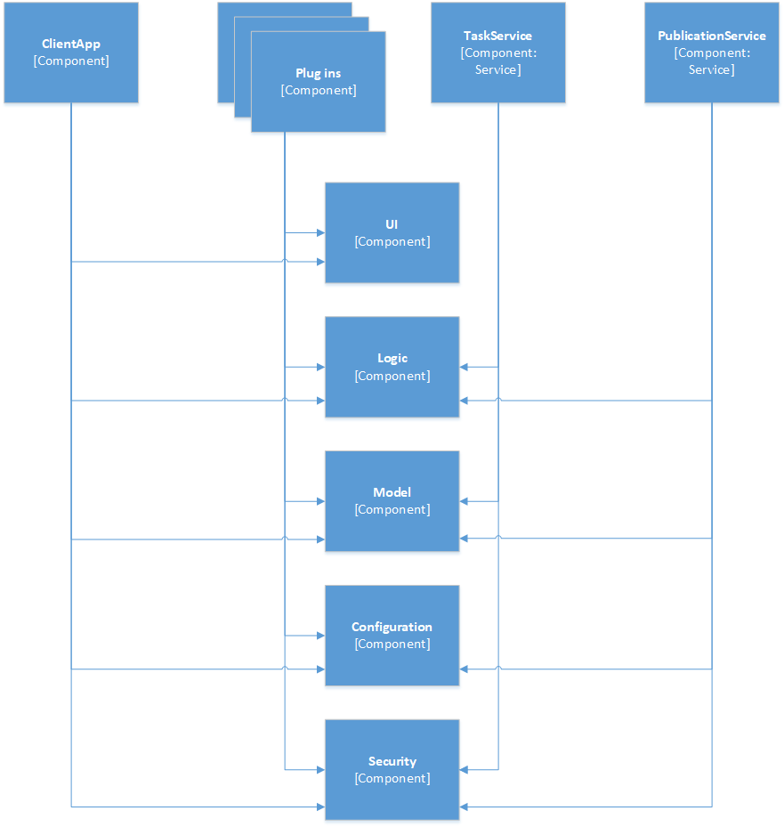

Developer guide
===============

 

This document is meant as a starting point for software developers who wish to
work with Questify Builder and further develop the application.

 

Build instructions
------------------

To build Questify Builder:

1.  Set *Questify.Builder.Client* as StartUp Project.

2.  Set build platform to *x86*.

 

Architecture with diagrams
--------------------------

The following diagrams of the Questify Builder architecture are drawn up using
[Simon Brown’s C4 model for visualizing software
architecture](https://c4model.com/). They describe the current architecture.

 

*Diagram 1: System Context diagram for Questify Builder*

 

*Diagram 2: Container diagram for Questify Builder*

 

*Diagram 3: Component diagram for Questify Builder*

 

Assemblies
----------

Questify Builder consists of the following assemblies:

| **Assemly name**                                     | **Remarks**                                                                                                   |
|------------------------------------------------------|---------------------------------------------------------------------------------------------------------------|
| Cito.ItemViewer.AsyncPluggableProtocol               |                                                                                                               |
| Cito.Tester.Common                                   | Legacy namespace, previously shared code (with other teams)                                                   |
| Cito.Tester.ContentModel                             | Legacy namespace, previously shared code (with other teams)                                                   |
| Questify.Builder.Client                              | Winforms client application                                                                                   |
| Questify.Builder.Configuration                       |                                                                                                               |
| Questify.Builder.IoC                                 |                                                                                                               |
| Questify.Builder.Logic                               |                                                                                                               |
| Questify.Builder.Logic.Service                       |                                                                                                               |
| Questify.Builder.Model.ContentModel                  | ORM classes as generated with LLBLGen Designer                                                                |
| Questify.Builder.Model.ContentModel.DatabaseSpecific | SQL Server specific code as generated by LLBL Gen ORM                                                         |
| Questify.Builder.Model.LlblGen.Proxy                 | Adapter to map classes to persist with LLBLGen                                                                |
| Questify.Builder.Packaging                           |                                                                                                               |
| Questify.Builder.Plugins.DataSource.DynamicGroups    |                                                                                                               |
| Questify.Builder.Plugins.DataSource.StaticGroups     |                                                                                                               |
| Questify.Builder.Plugins.Html.ComponentOne           |                                                                                                               |
| Questify.Builder.Plugins.MathML.Default              |                                                                                                               |
| Questify.Builder.Plugins.PaperBased                  |                                                                                                               |
| Questify.Builder.Plugins.QTI                  	   |                                                                                                               |
| Questify.Builder.Plugins.Reports.Excel               |                                                                                                               |
| Questify.Builder.Security                            |                                                                                                               |
| Questify.Builder.Security.ActiveDirectory            |                                                                                                               |
| Questify.Builder.Services.Math                       |                                                                                                               |
| Questify.Builder.Services.PublicationService         |                                                                                                               |
| Questify.Builder.Services.TasksService               |                                                                                                               |
| Questify.Builder.UI                                  |                                                                                                               |
| Questify.Builder.UI.Wpf                              |                                                                                                               |
| Questify.Builder.UnitTests                           |                                                                                                               |
| Questify.Builder.UnitTests.Framework                 |                                                                                                               |
| Questify.Builder.UnitTests.Html.ComponentOne         |                                                                                                               |
| Questify.Builder.UnitTests.Publication               |                                                                                                               |
| Questify.Builder.UnitTests.VB                        |                                                                                                               |

 

More information
----------------

Questify Builder can be extended by providing plugins and including these in the
deployment. For more information, click [here](PlugIns.md).

Questify Builder uses templates for item construction. The application comes
with a set of sample templates, but for more complex interaction types, you need
to build your own. For more information, click [here](Templates.md).

 
