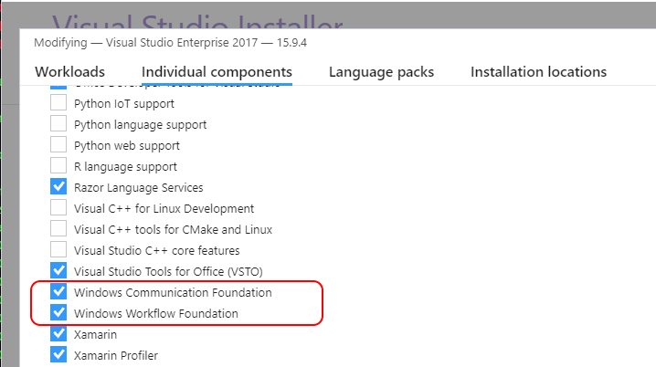
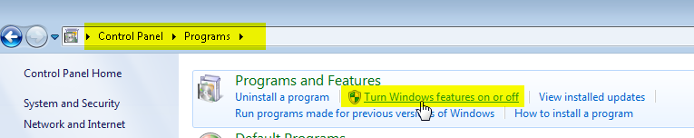
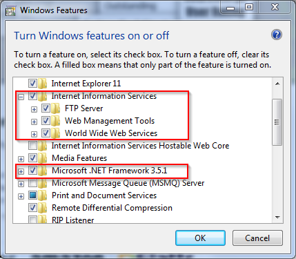
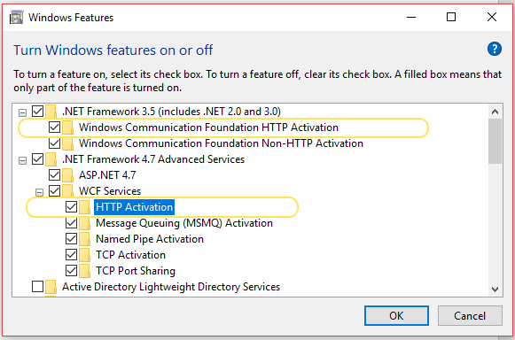
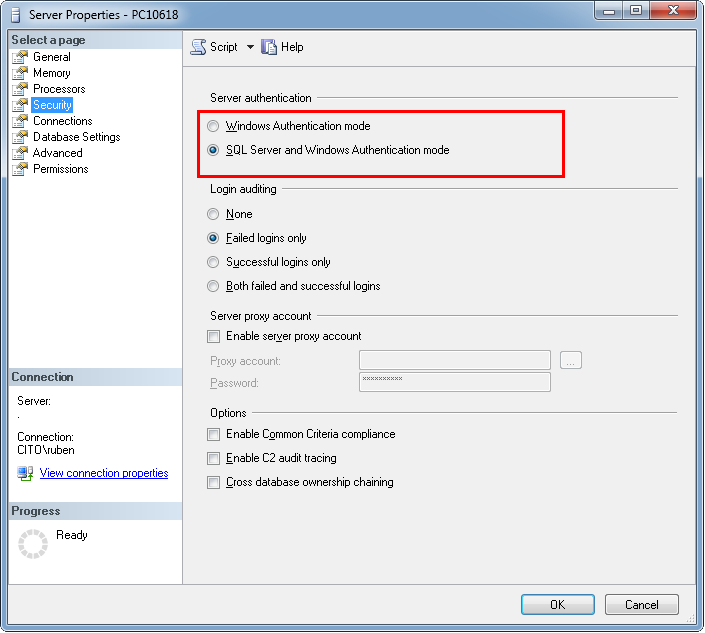

Getting Started: Building and running Questify Builder
======================================================

Prerequisites
-------------

To build and run Questify Builder the following needs to be in place:

-   A recent version of Visual Studio or alternative editor. We use Visual
    Studio 2017/2019, so any project files are for that version. 

-   WWF & WCF components need to be installed

-   A recent version of the .Net Framework. We currently compile against version
    4.7.1 of the .Net framework

-   Internet Information Server or alternative installed. 

- 	DotnetCore version 2.1.1 or higher installed

-   Commercial components: Janus Grid and C1 Xhtml Editor need to be installed.

-   SQL Server version version 2012 or higher with full-text search enabled.

 

Install WCF and WWF components
------------------------------

If you have Visual Studio installed (or are in the process of installing it)
make sure the WCF and WWF components are included. This can be done by starting
the Visual Studio Installer and make sure Windows Communication Foundation(WCF)
and Windows Workflow Foundation(WWF) are selected.

 

Installing and configuring IIS
------------------------------

To run Questify Builder make sure Internet Information Services (IIS) is
installed. This can be done through Control Panel \> Programs and Features \>
Turn Windows Features On or Off.

Make sure you select (at the least) Word Wide Web Services.

 

Enable HTTP Activation for WCF
------------------------------

From the dialog to Turn Windows Features On or Off, also make sure to enable
HTTP Activation for Windows Communication Foundation(WCF).

 

Install commercial components
-----------------------------

At this moment Questify Builder uses two commercial components, the Janus Grid
component and the ComponentOne Xhtml Editor component. If you want to run
Questify Builder without license warnings, you should buy a license for these
two components.

 

### Install ComponentOne

From ComponentOne Questify Builder uses the C1 Editor for editing Xhtml. This
component is sold as part of the ComponentOne Studio for Winforms suite. More
information can be found on
<https://www.grapecity.com/en/controls/winforms/editor>.

 

### Install Janus Grid

You can purchase and download the Janus GridEX Control for .Net from
<http://www.janusys.com>. Make sure that after install, you update the
references to the Janus dll’s to point to the folder where you’ve installed the
components.

 

SQL Server
----------

Note that to run Questify Builder you need an instance of SQL server running in
your network (or on your PC) with the Questify database deployed onto that
server. The schema for the Questify database is included in the source and can
be found in the SQL Server project called *QuestifyDatabaseSchema*.

If you want to use SQL authentication, make sure ‘mixed mode’ is enabled for SQL
Server. Of course, you could also use Windows Authentication.

Before starting Questify Builder for the first time, the database connection
strings need to be updated to use a username and password of your choosing. When
creating the database, create a user with access to the newly created database
and change the connection strings in the config files to use this user account.

 

>   **Note:** The database connection strings in various config files need to be
>   updated when changing the database, database user or database server name.
>   Make sure to update the config files of the following projects:

>   *Questify.Builder.Client*

>   *Questify.Builder.Services.PublicationService*

>   *Questify.Builder.Services.TaskService*

 

### Seed the database

Before you can start using Questify Builder, you need to seed the database with
some sample data, most notably a user with application administrator rights. You
can do this by running the *Script.PostDeployment.sql* script, which is included
in the source.

 

More information
----------------

An overview of the components that are used can be found [here](Components.md).

For a quick overview of the main parts and functionality of the application, see
[Using Questify Builder](Using%20Questify%20Builder.md).
