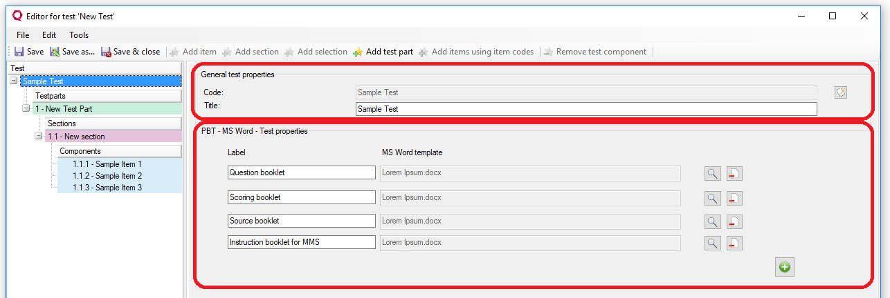
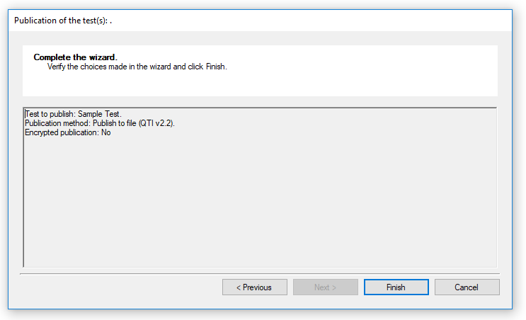
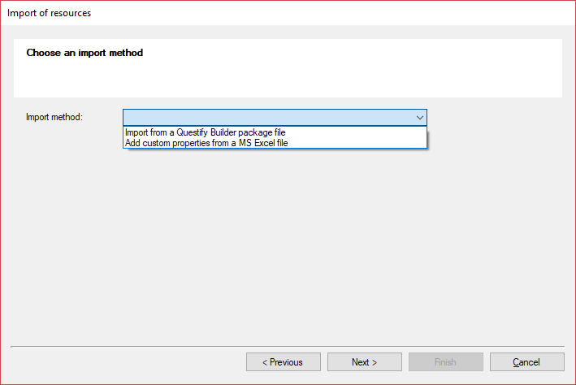

Extending Questify Builder with Plugins.
========================================

 

Questify Builder can be extended by providing plugins and including these in the
deployment. There are a number of interfaces that a plugin can implement to add
functionality to QB:

-   Test

-   TestPackage

-   Publication

-   Import

-   Reporting

-   Previewer

Furthermore Questify Builder has interfaces for the following editors:

-   MathML
 
-   Html

General approach
----------------

There are two places from which plugins can be loaded: they can be added either
to the Client/Bin/Plugins folder or to the Services.PublicationService.Plugins
folder. If the plugin implements one or more of the interfaces described in this
document, the implementation will be automatically loaded at runtime.

 

Extending Tests
---------------

De ITestEditorPlugin interface can be implemented to extend data and/or behavior
for editing Tests.

 

~~~~~~~~~~~~~~~~~~~~~~~~~~~~~~~~~~~~~~~~~~~~~~~~~~~~~~~~~~~~~~~~~~~~~~~~~~~~~~~~
Public Interface ITestEditorPlugin

    ReadOnly Property Name As String
    ReadOnly Property Description As String
    Function GetTestSectionPropertyEditor() As ITestSectionPartPropertyEditor
    Function GetTestPartPopertyEditor(ByVal assessmentTest As AssessmentTest2) As ITestPartPropertyEditor
    Function GetItemReferencePropertyEditor() As IItemReferencePropertyEditor
    Function GetTestPropertiesEditor() As IAssessmentTestPropertyEditor
    Function IsSupportedView(view As String) As Boolean
    Sub CodeChanged(testRef As TestPackage, newCodeName As String, oldCode As String)
    Sub UpdateName(testPackage As TestPackage, newCodeName As String, oldCode As String)

End Interface
~~~~~~~~~~~~~~~~~~~~~~~~~~~~~~~~~~~~~~~~~~~~~~~~~~~~~~~~~~~~~~~~~~~~~~~~~~~~~~~~

 

The Generic Test properties (*Title*, *Code*) are always displayed. Any custom
properties that are provided by a plugin will be displayed in the TestEditor.
Likewise the *TestPart* and *TestSection* parts of the TestEditor.

For example, in the TestEditor displayed below the first two properties *Code*
and *Title* are generic Test properties that are always displayed. You can find
the definition of these in the *Questify.Builder.UI* project under *Presentation
Controls*, *TestEditor*, *General_AssessmentTestPropertiesEditor*.

In this case a plugin is installed that allows the user to add a number of
booklets for paper based testing (PBT). Note that for this an instance of the
IAssessmentTestPropertyEditor interface is required that is of similar design to
the general properties editor.

 

Extending TestPackage
---------------------

Similar to extending the TestEditor, one can extend the TestPackage editor by
implementing the ITestPackageEditorPlugin Interface:

 

~~~~~~~~~~~~~~~~~~~~~~~~~~~~~~~~~~~~~~~~~~~~~~~~~~~~~~~~~~~~~~~~~~~~~~~~~~~~~~~~
Public Interface ITestPackageEditorPlugin

    ReadOnly Property Name As String
    ReadOnly Property Description As String
    Function GetTestPackagePropertiesEditor() As ITestPackageEditorPropertyEditor
    Function GetTestReferencePropertiesEditor() As ITestReferenceEditorPropertyEditor
    Function GetTestSetPropertiesEditor() As ITestSetEditorPropertyEditor
    Function IsSupportedView(view As String) As Boolean
    Sub CodeChanged(resourceEntity As TestPackageResourceEntity, newCodeName As String, oldCode As String)
    Sub LockTestOrderInTestSet(testSet As TestSet, propertyEditors As IEnumerable(Of ITestPackagePropertyEditor), doLock As Boolean)
    Sub DeleteTestPackageComponent(testPackage As TestPackage, selectedComponents As List(Of TestPackageNode), resourceEntity As TestPackageResourceEntity)
    Sub PreSave(testPackage As TestPackage)
    Sub AddTests(addToTestSet As TestSet, propertyEditors As IEnumerable(Of ITestPackagePropertyEditor))

End Interface
~~~~~~~~~~~~~~~~~~~~~~~~~~~~~~~~~~~~~~~~~~~~~~~~~~~~~~~~~~~~~~~~~~~~~~~~~~~~~~~~

 

Note that here are, as with Tests, three hierarchical levels at which custom
fields can be added - in this case

Test Package, Test Set or Test References.

 

Extending Publication
---------------------

For extending publication implement the IPublicationHandler interface.

 

~~~~~~~~~~~~~~~~~~~~~~~~~~~~~~~~~~~~~~~~~~~~~~~~~~~~~~~~~~~~~~~~~~~~~~~~~~~~~~~~
public interface IPublicationHandler
{
    string FileExtension { get; }
    string Errors { get; }
    string Warnings { get; }
    string UserFriendlyName { get; }
    bool CanHandleMultipleTests { get; }
    bool CanHandleSingleTests { get; }
    bool CanHandleTestPackage { get; }
    bool CanHandleBanks { get; }
    List<String> SupportedViews { get; }
    string ProgressMessage { get; }
    Dictionary<string, string> ExportedFiles { get; }
    DeliveryEngineTarget DeliveryEngineTarget { get; }
    Dictionary<string, string> Urls { get; }
    string ExternalId { get; }
    bool ShowTargetFileLocation { get;  }
    bool ShowPublicationOptions { get;  }
    bool ShowFileResultsAsUrl { get; }
    Dictionary<string,string> ConfigurationOptions { get; set; }
    string PublicationPath { get; set; }
    IPublicationSelection PublicationSelection { get; set; }
    System.Windows.Forms.UserControl PublicationOptionsControl { get; set; }
    Dictionary<string, string> GetConfigurationOptions(int bankId, IList<string> testNames, IList<string> testPackageNames);
    bool Publish(Dictionary<string, string> configurationOptions, int bankId, IList<string> testNames, IList<string> testPackageNames, string exportPath, bool isForPreview, string customName);
    bool PublishItem(System.IO.FileInfo packageFile, bool isEncryptedPackage, AssessmentItem assessmentItem);
    string PublishItem(AssessmentItem assessmentItem, ResourceManagerBase resourceManager);
    PluginHandlerConfigCollection HandlerConfig { get; set; }
    string FilePath { get; set; }
    event ProgressEventHandler Progress;
    event StartProgressEventHandler StartProgress;
    bool IsValid();
}
~~~~~~~~~~~~~~~~~~~~~~~~~~~~~~~~~~~~~~~~~~~~~~~~~~~~~~~~~~~~~~~~~~~~~~~~~~~~~~~~

 

To enable the custom publication implementation as an option in the publication
methods dropdown for the publication wizard, add the corresponding types to both
the *Client* app.config and the *PublicationService* web.config:

 

~~~~~~~~~~~~~~~~~~~~~~~~~~~~~~~~~~~~~~~~~~~~~~~~~~~~~~~~~~~~~~~~~~~~~~~~~~~~~~~~
<publicationHandlers>
    <handler type="Questify.Builder.Plugins.PaperBased.WordPublicationHandler" requireRestrictedPackagePublicationPermission="False">
      <testpreviewers>
        <testpreviewer name="Word" />
      </testpreviewers>
    </handler>
</publicationHandlers>
~~~~~~~~~~~~~~~~~~~~~~~~~~~~~~~~~~~~~~~~~~~~~~~~~~~~~~~~~~~~~~~~~~~~~~~~~~~~~~~~

 

Below, you see the Overview tab of the Publication Wizard. As you can tell by
the Publication method, the sample test is published using the
*GenericTestPublicationHandler* implementation of *IPublicationHandler*.

 

Extending Import
----------------

You can add a custom import method by providing an implementation of the
IImportHandler interface.

 

~~~~~~~~~~~~~~~~~~~~~~~~~~~~~~~~~~~~~~~~~~~~~~~~~~~~~~~~~~~~~~~~~~~~~~~~~~~~~~~~
Public Interface IImportHandler

    ReadOnly Property UserFriendlyName() As String
    ReadOnly Property ImportFileIsPackage() As Boolean
    ReadOnly Property SupportedResourceTypes() As ReadOnly Property ProgressMessage() As String
    ReadOnly Property GetOptionsUserControl() As ImportOptionControlBase
    Function Import(ByVal sourceResourceManager As ResourceManagerBase, ByVal bankId As Integer) As Boolean
    Function Import(ByVal packageSet As PackageSet, ByVal parentBankId As Integer?) As Boolean
    Function Import(ByVal  parentBankId As Integer?) As Boolean
    Event ImportHandlerHandleConflict As EventHandler(Of ImportHandlerHandleConflictEventArgs)
    Event ImportHandlerHandleError As EventHandler(Of ImportExportHandlerHandleErrorEventArgs)
    Event ImportHandlerCustomBankPropertiesRemoved As EventHandler(Of ImportCustomBankPropertiesRemovedArgs)
    Event ImportHandlerHandleWarning As EventHandler(Of ImportExportHandlerHandleWarningEventArgs)   
    Event Progress(ByVal sender As Object, ByVal e As ProgressEventArgs)
    Event StartProgress(ByVal sender As Object, ByVal e As StartEventArgs)

End Interface
~~~~~~~~~~~~~~~~~~~~~~~~~~~~~~~~~~~~~~~~~~~~~~~~~~~~~~~~~~~~~~~~~~~~~~~~~~~~~~~~

 

When the import wizard is shown, it will allow the user to select an import
method from the configured import handlers. In the app.config of the Client
project, there is a configuration section to specify the importhandlers:

 

~~~~~~~~~~~~~~~~~~~~~~~~~~~~~~~~~~~~~~~~~~~~~~~~~~~~~~~~~~~~~~~~~~~~~~~~~~~~~~~~
<importHandlers>
    <handler type="Questify.Builder.Client.ExcelImportHandler, Questify.Builder.Client" />
 </importHandlers>
~~~~~~~~~~~~~~~~~~~~~~~~~~~~~~~~~~~~~~~~~~~~~~~~~~~~~~~~~~~~~~~~~~~~~~~~~~~~~~~~

 

A plugin can provide one or more implementations of the IImporthandler
interface, and if these are added to the config file they will be displayed as
an option in the import wizard using the UserFriendlyName property.

 

Extending Reporting
-------------------

To add custom reporting, add an implementation of the IReportHandler interface
to your plugin

 

~~~~~~~~~~~~~~~~~~~~~~~~~~~~~~~~~~~~~~~~~~~~~~~~~~~~~~~~~~~~~~~~~~~~~~~~~~~~~~~~
public interface IReportHandler : IReportValidationBase
{
    event ReportCompletedEventHandler ReportCompleted;
    string Overview { get; }
    string ValidationErrors { get; }
    string ResultText { get; }
    string ExportedReportLocation { get; }
    string ExtraOptionTask { get; }
    string ExtraOptionTaskDescription { get; }
    bool ShowExtraOptionsTab { get; }
    bool ShowInitialiseProgressTab { get; }
    bool ShowCreateReportProgressTab { get; }
    bool ShowSelectLocationTab { get; }
    bool IsDataGeneratedAsynchronous { get; }
    bool IsInitDataGeneratedAsynchronous { get; }
    bool ShouldUseCollectionAsInput { get; }
    bool ShouldUseGridAsInput { get; }
    object GridToExport { set; }
    System.Windows.Forms.UserControl GetExtraOptionsUI();
    System.Windows.Forms.UserControl GetExportLocationUI();
    void InitialiseData();
    bool GenerateData();
    void ClearErrors();
}
~~~~~~~~~~~~~~~~~~~~~~~~~~~~~~~~~~~~~~~~~~~~~~~~~~~~~~~~~~~~~~~~~~~~~~~~~~~~~~~~

 

To enable the custom report, add your implementation to the \<reportHandlers\>
section in the config:

 

~~~~~~~~~~~~~~~~~~~~~~~~~~~~~~~~~~~~~~~~~~~~~~~~~~~~~~~~~~~~~~~~~~~~~~~~~~~~~~~~
<reportHandlers>
    <handler type="Questify.Builder.Plugins.Reports.Excel.ExcelReport, Questify.Builder.Plugins.Reports.Excel" />
</reportHandlers>
~~~~~~~~~~~~~~~~~~~~~~~~~~~~~~~~~~~~~~~~~~~~~~~~~~~~~~~~~~~~~~~~~~~~~~~~~~~~~~~~

 

Extending Previewing
--------------------

For custom previewing implement the IItemPreviewHandler interface.

 

~~~~~~~~~~~~~~~~~~~~~~~~~~~~~~~~~~~~~~~~~~~~~~~~~~~~~~~~~~~~~~~~~~~~~~~~~~~~~~~~
public interface IItemPreviewHandler
{
    PublicationResult SetupItemPreview(int bankId, AssessmentItem assessmentItem, bool isDebug, List<PublicationProperty> publicationProperties);
    void CleanUp();
    void Validate(AssessmentItem assessmentItem, ref string warnings, ref string errors);
    ResourceManagerBase ResourceManager { get; set; }
    PreviewControl PreviewControl { get; }
    string PreviewTarget { get; }
    string PublicationLocation { get; }
    string UserFriendlyName { get; }
    Dictionary<string, System.Drawing.Size> Dimensions { get; }
    bool ShowTestMonitor { get; }
    string ServiceName { get; }
}
~~~~~~~~~~~~~~~~~~~~~~~~~~~~~~~~~~~~~~~~~~~~~~~~~~~~~~~~~~~~~~~~~~~~~~~~~~~~~~~~

 

Add any ItemPreviewer implementation to the corresponding section.

 

~~~~~~~~~~~~~~~~~~~~~~~~~~~~~~~~~~~~~~~~~~~~~~~~~~~~~~~~~~~~~~~~~~~~~~~~~~~~~~~~
<itemPreviewHandlers>
    <handler type="Questify.Builder.Plugins.PaperBased.Word_ItemPreviewHandler, Questify.Builder.Plugins.PaperBased" />
</itemPreviewHandlers>
~~~~~~~~~~~~~~~~~~~~~~~~~~~~~~~~~~~~~~~~~~~~~~~~~~~~~~~~~~~~~~~~~~~~~~~~~~~~~~~~

Implementing MathML
--------------------

To support editing/rendering MathML in QB one should implement the following interface. 

 

~~~~~~~~~~~~~~~~~~~~~~~~~~~~~~~~~~~~~~~~~~~~~~~~~~~~~~~~~~~~~~~~~~~~~~~~~~~~~~~~
Public Interface IMathMlEditorPlugin

    Function GetMathMlEditorControl(inContentMode As Boolean) As IMathMlEditorControl
    Function RenderPng(mathMl As String) As Byte()
    Function RenderPng(mathMl As String, imageOptions As Dictionary(Of String, String)) As Byte()
    Function RenderPng(mathMl As String, imageOptions As Dictionary(Of String, String), ByRef verticalAlignValue As Double) As Byte()

End Interface
~~~~~~~~~~~~~~~~~~~~~~~~~~~~~~~~~~~~~~~~~~~~~~~~~~~~~~~~~~~~~~~~~~~~~~~~~~~~~~~~

To make this plugin work in QB, make sure it is added to the Client/Bin/Plugins folder and/or to the 
Services.PublicationService.Plugins folder. 
There is no need to add this implementation to any config section. QB will automatically load 
and use the (first) MathML plugin it can find in the folders mentioned above.

The current Open Source version of QB comes with a MathML plugin, named Questify.Builder.Plugins.MathML.Default.

Implementing Html
--------------------

To support editing HTML in QB there should be one implementation/plugin with the following interface. 

~~~~~~~~~~~~~~~~~~~~~~~~~~~~~~~~~~~~~~~~~~~~~~~~~~~~~~~~~~~~~~~~~~~~~~~~~~~~~~~~
Public Interface IXHtmlEditor
    Inherits ICutPaste
    Inherits IMedia
    Inherits IRichText
    Inherits IInline

    Event AddedInlineCustomInteraction As EventHandler(Of InlineElementEventArgs)
    Event RemovedInlineCustomInteraction As EventHandler(Of InlineElementEventArgs)
    Event AddedInlineAspect As EventHandler(Of InlineElementEventArgs)
    Event RemovedInlineAspect As EventHandler(Of InlineElementEventArgs)
    Event ContentChanged As EventHandler(Of EventArgs)
    Event InlineElementsCollectionChanged As EventHandler(Of NotifyCollectionChangedEventArgs)

    Property FormClosing As Boolean
    Property MouseFocused As Boolean
    Property ActiveReference As XhtmlReference
    Property Parent As Control
    Property Dock As DockStyle
    Property Size As Size
    Property Document As XmlDocument
    ReadOnly Property Selection() As ISelection
    <Browsable(False)>
    ReadOnly Property DefaultNamespaceManager As XmlNamespaceManager

    ReadOnly Property IsInline As Boolean

    Sub InitCaret(x As Integer, y As Integer, isMouseFocused As Boolean)

    Sub SetHtmlValue(behavior As IHtmlEditorBehaviour)
    Sub UpdateValue()
    Sub OpenSymbolDialog()
    Sub AddNodeAfterCurrentNode(newNode As XmlNode, isNew As Boolean)
    Sub BringToFront()
    Sub Dispose()
    Sub SetFocus()
    Sub LoadXml(outerXml As String)

    Sub BeginTransaction()
    Sub CommitTransaction()
    Sub RollbackTransaction()
    sub DoPasteAsText()
    
    Sub ClearSelection()
    Sub [Select](xmlNode As XmlNode)
    Sub [Select](start As Integer, length As Integer)
    Sub ShowNewTableDialog(drawingPoint As Point)
    Function SelectedText() As String
    Function CreateRangeFromSelection() As ITextRange
    Function CreateRange(start As Integer, length As Integer) As ITextRange
    Sub SetTabStop(value As Boolean)

End Interface
~~~~~~~~~~~~~~~~~~~~~~~~~~~~~~~~~~~~~~~~~~~~~~~~~~~~~~~~~~~~~~~~~~~~~~~~~~~~~~~~

To make this plugin work in QB, make sure it is added to the Client/Bin/Plugins folder. 
There is no need to add this implementation to any config section. QB will automatically load 
and use the (first) HtmlEditor plugin it can find in this folder.

The current Open Source version of QB comes with a HtmlEditor plugin, named Questify.Builder.Plugins.Html.ComponentOne. 
This plugin uses a paid component: ComponentOne C1 Editor.