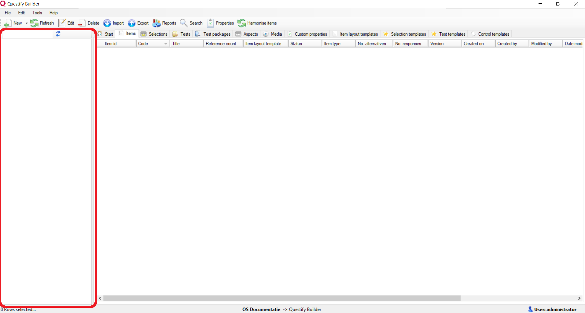
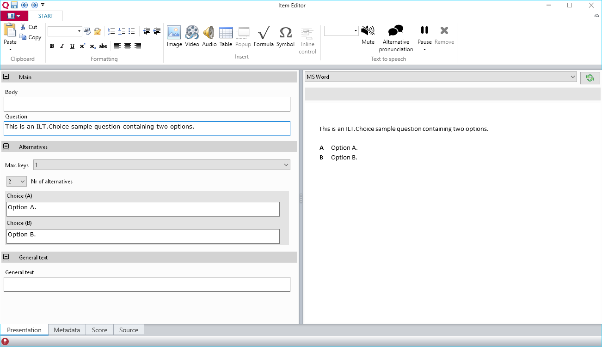
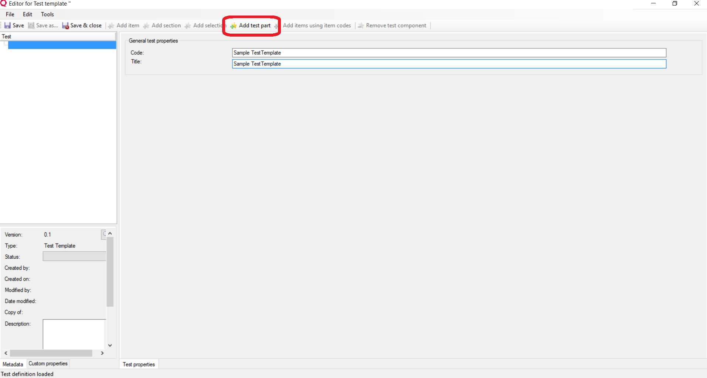
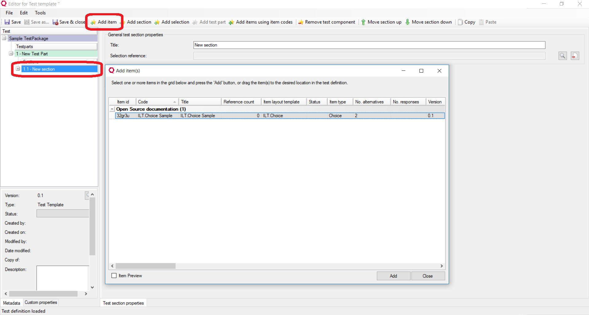
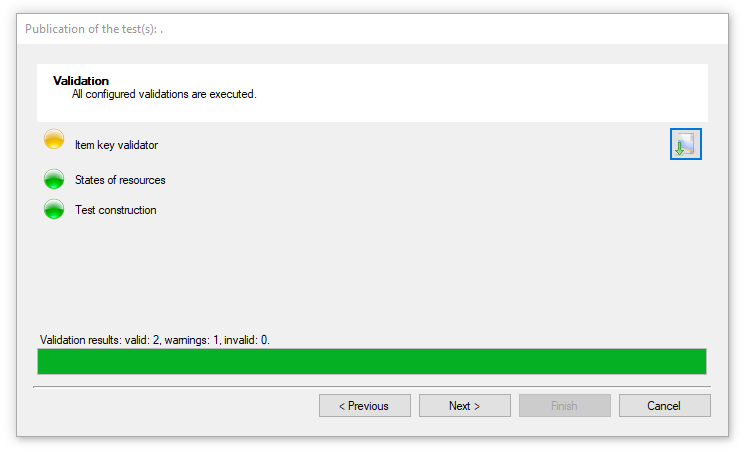

Using Questify Builder
======================

 

This section will walk you through the basics of Questify Builder. After reading
this section, you will have a good idea how to use Questify Builder. In order to
get started, you will need to know how to create item banks, items and tests,
and how to publish tests.

 

Start Questify Builder and log on
---------------------------------

To log in to Questify Builder, enter your *username* and *password*.

 

>   **Note:** When you start the application in Visual Studio in DEBUG mode,
>   your login credentials will be provided for you automatically.

 

Create item banks
-----------------

Item banks contain the resources you need for constructing tests: items,
templates and the tests themselves, among others. Item banks create a logical
division between your content and allow you to restrict user access to specific
banks.

 

To add an item bank, right-click the Banks pane on the left side of the *Main
Form*. In the context menu, click *Add bank at root level*. In the window which
pops up, enter a *name* in the **Name** field and click **Add**.

 

Import templates
----------------

Questify Builder uses templates for item construction. *Item Layout Templates*
(ILTs) structure the layout of an item. *Control Templates* (CTs) are part of
ILTs and contain logic for specific types of interaction, such as *Multiple
Choice* or *Text*.

Questify Builder comes with a set of templates with which you can construct your
own QTI-L1 level tests. This set may serve as a jumping off point for developers
to construct their own templates containing more complex interactions. For more
information, click [here](Templates.md).

 

>   **Note:** Questify Builder package files can be recognized by their
>   *.export* file extension.

 

In Questify Builder, click **Import** in the menu at the top of the screen.
    An import wizard will guide you through importing the file. If you clicked
    Import from anywhere other than the Start tab, make sure you select *Import
    from a Questify Builder package file* as your import method, and select the
OpenSource.export file from the Content folder to import the standard templates.

 
If the import was successful, you will find several ILTs and CTs under the tabs
*Item layout templates* and *Control templates* respectively.

 

Create items
------------

To create new items:

1.  Go the *Items* tab and click **New**. Alternatively, you can click the
    downward arrow next to **New**, and click **Item** in the resulting drop
    down menu.

2.  Select an ILT and click **OK**. This will open the *Item Editor*.

3.  The Item Editor will open on the *Metadata* tab. Before continuing, provide
    at least an *item code* and *item title* in the **Code** and **Title**
    fields.

4.  On the *Presentation* tab, you can add the item content. The left side of
    the screen consists of xHtml fields in which you can edit your content.
    The right side shows a previewer in which, depending on the selected
    target, you can preview the changes you've made.

>   **Note:** If you chose the *ILT.Choice* or *ILT.ExtendedText* ILTs, the
>   interaction type has already been added for you. If you chose the *ILT.Text*
>   ILT, you can add your interaction manually by clicking **Inline control** in
>   the menu at the top of the page. You can add three types of text fields:
>   *Text*, *Integer* and *Decimal*, depending on the type of input you expect.

5.  On the *Score* tab, you can specify the score method and the value of the
    correct answer (the key).

6.  On the *Source* tab, you will find an XML representation of the item you
    have just created.

7.  To save the item, click the Save icon in the top left of the screen.

 

Create tests
------------

Once you have created one or more items, you can construct a test.

>   **Note:** A test consists of one or more *test parts* containing one or more
>   *test sections*. A test section contains one or more *items*.

 

To create a new test, you must first create a test template.

1.  Go to the *Test templates* tab and click **New**. Alternatively, you can
    click the downward arrow next to **New**, and click **Test template** in the
    resulting drop down menu.

2.  Select *Generic test* and click **OK**. This will open the *Test Editor*.

3.  Before continuing, provide at least a *test code* and *test title* in the
    **Code** and **Title** fields.

4.  To add a test part and underlying test section, click **Add test part**. You
    can alter the name of the test part or test section by selecting the part or
    section and entering a new title in the **Title** field.

5.  Optional: To add one or more items, select a test section and click **Add
    item**. This will open a dialog in which you can see the available items in
    the item bank. Select one or more items and click **Add** to add the items
    to the section.

6.  To save the test template, click the Save icon in the top left of the
    screen.

 

Now that you have a test template, you can start constructing tests. To
construct tests:

1.  Go to the *Tests* tab and click **New**. Alternatively, you can click the
    downward arrow next to **New**, and click **Test** in the resulting drop
    down menu.

2.  Select the test template you have just created and click **OK**. This will
    open the *Test Editor*.

3.  Follow steps 3 - 5 above.

4.  To save the test, click the Save icon in the top left of the screen.

 

Publish tests or test packages
------------------------------

To publish a test:

1.  Go to the *Tests* tab.

2.  Select the test you want to publish, and click **Publish** in the menu at
    the top of the screen.

3.  A publication wizard will guide you through publication. A number of
    validators will check your test for errors. For example, if you have
    forgotten to provide a key for one or more items, the *Item key validator*
    will give you a warning before publishing the test.

If the publication was successful, you will find your test in the folder you
specified when stepping through the wizard.

 

This concludes the walk through of the Questify Builder basics. You are now
free to start constructing your own tests and explore the more advanced
features Questify Builder has to offer.
